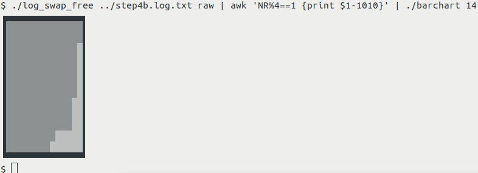

# temp_freq_cpus

* [Introduction](#introduction)
* [Layouts](#layouts)
* [Utilizing "tee"](#utilizing-tee)
* [Viewing log with "more -N"](#viewing-log-with-more--n)
* [Statistic tools](#statistic-tools)
  * [Raw mode](#raw-mode)
  * [awk_stats](#awk_stats)
* [barchart tool [and awk for data reduction+scaling]](#barchart-tool-and-awk-for-data-reductionscaling)
  * [Using awk for data reduction and scaling](#using-awk-for-data-reduction-and-scaling)
* [Log conversion to CSV](#log-conversion-to-csv)

## Introduction

[temp_freq_cpus](tools/temp_freq_cpus) [and [temp_freq_cpus_free](tools/temp_freq_cpus_free)] are Raspbian monitoring tools for:
* temperature of BCM2835 SoC
* arm clock frequency
* cpu statistics per core
* summary cpu statistics
* [memory and swap data]

## Layouts

They use VT100 escape code to clear screen and then display the measured information in either this layout:


```

11/01/19 13:49:19.154(0.99)  temp=53.0'C  frequency(48)=600169920

%Cpu0  :  0.0 us,  0.0 sy,  0.0 ni,100.0 id,  0.0 wa,  0.0 hi,  0.0 si,  0.0 st
%Cpu1  :  0.0 us, 16.7 sy,  0.0 ni, 83.3 id,  0.0 wa,  0.0 hi,  0.0 si,  0.0 st
%Cpu2  :  0.0 us,  0.0 sy,  0.0 ni,100.0 id,  0.0 wa,  0.0 hi,  0.0 si,  0.0 st
%Cpu3  :  0.0 us,  0.0 sy,  0.0 ni,100.0 id,  0.0 wa,  0.0 hi,  0.0 si,  0.0 st

%Cpu(s):  4.0 us,  1.3 sy,  0.0 ni, 94.7 id,  0.0 wa,  0.0 hi,  0.0 si,  0.0 st

```

The first empty line allows to grep the other lines without the clear scren escape, the other two empty lines separate information. The tool determines all information, and after a specific amount of time is gone, then the screen gets updated.

First line shows date and  time at millisecond precision, the passed delay (in seconds, does not need to be integer) in parenthesis, the soc temperature and arm frequency.

The 2nd block is cpu statistics per core taken from top command.

The 3rd block is summary cpu statistics from top command.

Or this layout:

```

11/02/19 22:34:00.668(59.99)  temp=80.0'C  frequency(48)=1500398464

%Cpu0  : 94.1 us,  5.9 sy,  0.0 ni,  0.0 id,  0.0 wa,  0.0 hi,  0.0 si,  0.0 st
%Cpu1  :100.0 us,  0.0 sy,  0.0 ni,  0.0 id,  0.0 wa,  0.0 hi,  0.0 si,  0.0 st
%Cpu2  : 88.2 us, 11.8 sy,  0.0 ni,  0.0 id,  0.0 wa,  0.0 hi,  0.0 si,  0.0 st
%Cpu3  : 76.5 us, 23.5 sy,  0.0 ni,  0.0 id,  0.0 wa,  0.0 hi,  0.0 si,  0.0 st

%Cpu(s): 91.2 us,  8.8 sy,  0.0 ni,  0.0 id,  0.0 wa,  0.0 hi,  0.0 si,  0.0 st

MiB Mem :   3727.6 total,    241.2 free,    268.8 used,   3217.6 buff/cache
MiB Swap:   1024.0 total,   1021.2 free,      2.8 used.   3306.8 avail Mem 
```

The 4th block is data on memory and swap.

## Utilizing "tee"

Best use is by utilising "tee" command to store the output to log file and see live on screen.  
This is command that is useful to get roughly updates every second:

    temp_freq_cpus 0.99 | tee log.txt

The [sample log file](step2.log.txt) was captured that way, while doing dependency installations for OpenCV according "step 2" of [this instruction](https://www.pyimagesearch.com/2019/09/16/install-opencv-4-on-raspberry-pi-4-and-raspbian-buster/). Passing 0.99 seconds resulted in nearly exact 1 second steps between log entries.

The [2nd sample log file](step4b.log.txt) was captured with 59.99 instead of 0.99 for the same reasons, while doing 48min compilation of OpenCV according "step 4b" of pointed to instruction. Passing 59.99 seconds resulted in nearly exact 1 minute steps between log entries.

## Viewing log with "more -N"

Looking at either log file is not simple because of the contained VT100 escapes. You can best view a log file on command line with "more -9 log.txt" ["more -12 log.txt"] command. That ensures that only the 9[12] lines belonging together are shown. Pressing "z" shows the next 9[12] lines, pressing "b" shows the previous 9[12] lines.

## Statistic tools

There are some tools that allow to extract information from a log file.

[log_freq](tools/log_frew) does a frequency distribution analysis:

    $ tools/log_freq step2.log.txt 
        111 600117184
        166 600169920
         57 1500345728
         40 1500398464
    $

[log_temp](tools/log_temp) does temperature distribution analysis:

```
$ ./log_temp ../step4b.log.txt
      1 56.0
      1 62.0
      1 70.0
      1 71.0
      1 72.0
      4 73.0
      1 74.0
      4 75.0
      4 76.0
      2 77.0
      3 78.0
      9 79.0
     14 80.0
      2 81.0
$ 
```

[log_cpus_us](tools/log_cpus_us) does summary user time analysis (in percent, skipping the fractional part information received from top):

```
$ ./log_cpus_us ../step4b.log.txt
      1   0
      1   1
      2  48
      3  50
      1  51
      1  52
      1  82
      2  84
      1  85
      3  86
      1  87
      2  89
      2  90
      3  91
      7  92
      3  93
      4  94
      3  95
      1  96
      2  97
      3  98
      1 100
$ 
```

[log_mem_free](tools/log_mem_free) does free memory(MiB) analysis:

```
$ ./log_mem_free ../step4b.log.txt 
      1      72
      1      73
      1      75
      1      76
      1     101
...
...
      1    2414
      1    2466
      1    2477
      1    2539
      1    2627
$
```

[log_swap_free](tools/log_swap_free) does free swap(MiB) analysis:

```
$ ./log_swap_free ../step4b.log.txt 
      5    1018
      3    1019
      3    1021
     10    1022
     19    1023
      8    1024
$
```

These tools can be used as basis for other log information extraction tools.

### Raw mode

All statistic tools act differently when "raw" is passed as 2nd argument.  
In that case the raw data is extracted without analysis, eg. for use with barchart tool.

### awk_stats

[awk_stats](tools/awk_stats) gives you quick min/mean/max analysis of 1st column of data:

```
$ tools/log_temp step4b.log.txt raw | tools/awk_stats 
56.0 76.7083 81.0
$ 
```

## barchart tool [and awk for data reduction+scaling]

Simple [barchart](tools/barchart) tool allows to display raw data extracted with the statistic tools.  

Without argument just the bars are drawn. Real numbers get rounded half to even:

```
$ echo -e "1.4999\n2.5\n3\n4\n0" | ./barchart
▒
▒▒
▒▒▒
▒▒▒▒

$
```

In browser the barchart does not look that nice as in console, therefore showing screenshots from now on.  
A passed argument tells the maximal value of data entries. In this case a border will be drawn around the barchart, and the area unfilled with grey gets filled with light grey:


In case value passed is less than a data entry, border just gets overpainted to highlight that fact:


### Using awk for data reduction and scaling

The [2nd sample log file](step4b.log.txt) mentioned before has 48 data entries and would result in 50 line barchart including border lines. In such cases data reduction can be useful. That can be done with any command line tool, here I will demonstrate that "awk" is quite good, see [basic awk examples](https://www.tutorialspoint.com/awk/awk_basic_examples.htm).

The measured frequencies during the 48 minutes of OpenCV compilation are 600MHz and 1.5GHz -- big numbers. Here awk scaled the values down to 0-15 range for barchart display. In addition the number of 48 data points gets reduced by selecting only data line numbers (NR) matching "NR%5%2==1". This results in 20 entries only, This specific expression was selected to match first and last data lines:  
```
$ ./log_freq ../step4b.log.txt raw | awk 'NR%5%2==1 {print $1/100000000}' | ./barchart 15
```


The swap space used only reduced slightly from 1024(100%) to 1018. In this case subtracting 1010 reduces horizontal range to 0-14. Here simpler line selection was used:  

```
$ ./log_swap_free ../step4b.log.txt raw | awk 'NR%4==1 {print $1-1010}' | ./barchart 14
```



## Log conversion to CSV

[log2csv](tools/log2csv) converts a 9 line per entry log file into CSV standard data format for further processing by eg. spreadsheet.

    $ tools/log2csv step2.log.txt
    11/01/19,13:43:06.517,50.0,600169920
    ,,,,%Cpu0  ,0.0,0.0,0.0,100.0,0.0,0.0,0.0,0.0
    ,,,,%Cpu1  ,0.0,0.0,0.0,100.0,0.0,0.0,0.0,0.0
    ,,,,%Cpu2  ,0.0,16.7,0.0,83.3,0.0,0.0,0.0,0.0
    ,,,,%Cpu3  ,0.0,0.0,0.0,100.0,0.0,0.0,0.0,0.0
    ,,,,%Cpu(s),1.5,1.5,0.0,97.0,0.0,0.0,0.0,0.0
    11/01/19,13:43:07.520,49.0,600117184
    ...
    ...
    ,,,,%Cpu(s),0.0,5.3,0.0,94.7,0.0,0.0,0.0,0.0
    11/01/19,13:49:19.154,53.0,600169920
    ,,,,%Cpu0  ,0.0,0.0,0.0,100.0,0.0,0.0,0.0,0.0
    ,,,,%Cpu1  ,0.0,16.7,0.0,83.3,0.0,0.0,0.0,0.0
    ,,,,%Cpu2  ,0.0,0.0,0.0,100.0,0.0,0.0,0.0,0.0
    ,,,,%Cpu3  ,0.0,0.0,0.0,100.0,0.0,0.0,0.0,0.0
    ,,,,%Cpu(s),4.0,1.3,0.0,94.7,0.0,0.0,0.0,0.0
    $

The 1st and 374th(last) timestamps of [sample log file](step2.log.txt) show, that little less than 373 seconds have passed between first and last log entry (372.637 seconds).  

[log2csv2](tools/log2csv2) converts a 12 line per entry log file into CSV standard data format for further processing by eg. spreadsheet.

```
$ ./log2csv2 ../step4b.log.txt |head -13
11/02/19,21:55:00.760,56.0,600169920
,,,,,,,,,,,,,%Cpu0  ,,,,,,,,,0.0,0.0,0.0,100.0,0.0,0.0,0.0,0.0
,,,,,,,,,,,,,%Cpu1  ,,,,,,,,,10.5,10.5,0.0,78.9,0.0,0.0,0.0,0.0
,,,,,,,,,,,,,%Cpu2  ,,,,,,,,,0.0,0.0,0.0,100.0,0.0,0.0,0.0,0.0
,,,,,,,,,,,,,%Cpu3  ,,,,,,,,,0.0,0.0,0.0,100.0,0.0,0.0,0.0,0.0
,,,,,,,,,,,,,%Cpu(s),1.3,3.9,0.0,94.7,0.0,0.0,0.0,0.0
,,,,MiB Mem ,3727.6,2627.2,108.4,992.0
,,,,MiB Swap,,,,,1024.0,1024.0,0.0,3475.2
11/02/19,21:56:00.760,70.0,1500345728
...
```


The 1st and 48th(last) timestamps of [sample log file 2](step4b.log.txt) show, that little less than 47 minutes have passed between first and last log entry (46.871 minutes).  

```
$ grep temp step4b.log.txt | head -1
11/02/19 21:55:00.760(59.99)  temp=56.0'C  frequency(48)=600169920
$ grep temp step4b.log.txt | tail -1
11/02/19 22:42:00.631(59.99)  temp=62.0'C  frequency(48)=600169920
$ grep temp step4b.log.txt | wc --lines
48
$ 
```
